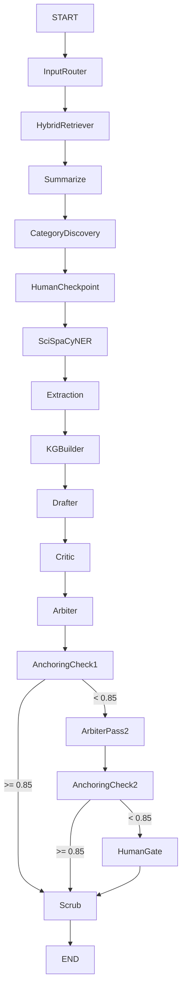

# Deep Mode Graph

17-node LangGraph for rigorous biomedical synthesis with debate and anchoring.

## Graph Overview



## Node Descriptions

| Node | Description |
|------|-------------|
| `InputRouter` | Parses query, determines mode and scope |
| `HybridRetriever` | Fused BM25 + ChromaDB retrieval |
| `Summarize` | Condenses retrieved chunks |
| `CategoryDiscovery` | LLM discovers themes, variables, methods |
| `HumanCheckpoint` | User reviews/edits categories |
| `SciSpaCyNER` | 155+ biomedical entity types |
| `Extraction` | LLM structures entities into categories |
| `KGBuilder` | Builds co-occurrence knowledge graph |
| `Drafter` | Writes initial synthesis with citations |
| `Critic` | Identifies ungrounded claims |
| `Arbiter` | Revises draft addressing critiques |
| `AnchoringCheck1` | Programmatic evidence grounding |
| `ArbiterPass2` | Second revision pass |
| `AnchoringCheck2` | Second grounding check |
| `HumanGate` | Human review for low-scoring outputs |
| `Scrub` | Boundary sanitization + formatting |

## Human-in-the-Loop Checkpoints

1. **After CategoryDiscovery** — User can refine discovered categories before NER
2. **HumanGate** — Triggered when anchoring score < 0.85 after second pass

## Flow Logic

```
AnchoringCheck1 →
  score >= 0.85 → Scrub → END
  score < 0.85  → ArbiterPass2 → AnchoringCheck2 →
    >= 0.85 → Scrub → END
    < 0.85  → HumanGate → Scrub → END
```

## Use Case

Rigorous synthesis with debate and anchoring. ~30-60s per query. Best for detailed biomedical questions requiring evidence-grounded answers with citation trails.
