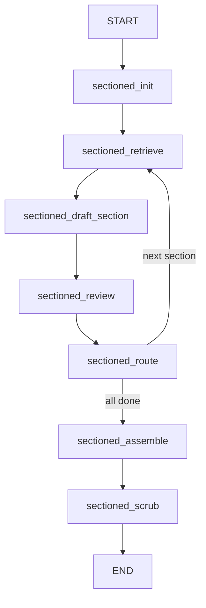

# Sectioned Survey Graph

8-node LangGraph for multi-turn IMRaD sectioned writing (Phase 7b).

## Graph Overview

## Node Descriptions

| Node | Description |
|------|-------------|
| `sectioned_init` | Plans IMRaD sections, initializes claim ledger |
| `sectioned_retrieve` | Retrieves chunks with `include_figures=True` |
| `sectioned_draft_section` | Drafts one section with prior context |
| `sectioned_review` | Human reviews and approves section |
| `sectioned_route` | Routes to next section or assembly |
| `sectioned_assemble` | Merges all sections into final document |
| `sectioned_scrub` | Boundary sanitization + formatting |

## Human-in-the-Loop

`interrupt_at_review` — User approves each section before the next begins. Enables iterative refinement per IMRaD section.

## Claim Ledger Integration

- SHA-256 deduplication across sections — prevents repeating claims in multiple sections
- Citation coverage tracking — monitors which papers are cited across sections

## Figure Integration

`include_figures=True` in `sectioned_retrieve` — figure descriptions passed alongside text chunks.

## Prior Section Context

Each section receives summaries of prior sections to maintain continuity and avoid redundancy across the IMRaD structure.

## Independence

Separate from main Survey Mode — independent graph, independent state fields (Phase 7b fields). Does not share state with the 8-node survey graph.
