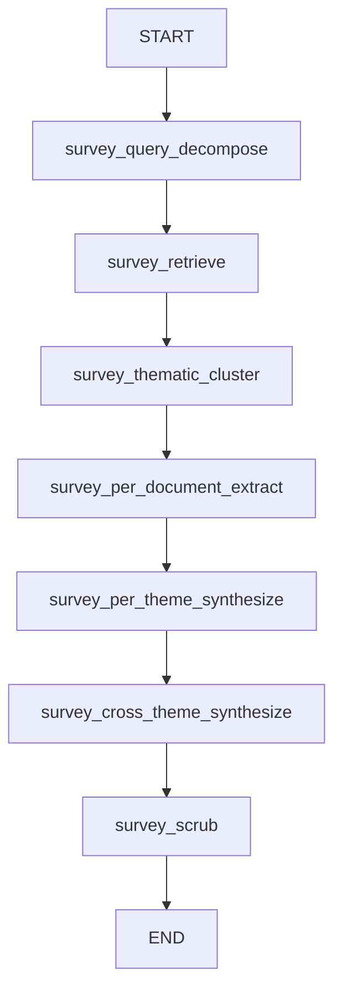

# Survey Mode Graph

8-node LangGraph for broad literature survey with thematic clustering.

## Graph Overview

## Node Descriptions

| Node | Description |
|------|-------------|
| `survey_query_decompose` | Breaks query into 3-8 themed sub-queries |
| `survey_retrieve` | Hybrid retrieval per sub-query, includes figures |
| `survey_thematic_cluster` | Embedding-based clustering of papers |
| `survey_per_document_extract` | Entity extraction per paper per theme |
| `survey_per_theme_synthesize` | Debate + synthesis per theme |
| `survey_cross_theme_synthesize` | Merged analysis across all themes |
| `survey_scrub` | Boundary sanitization + formatting |

## Key Optimizations

- **Per-theme parallel**: `ThreadPoolExecutor(max_workers=2)` for theme processing
- **Single-paper themes skip LLM**: Direct entity formatting when only 1 paper in theme
- **Conditional critic threshold**: 0.50 (critique only if grounding below threshold)
- **Gap analysis parallel**: Runs concurrently with cross-theme synthesis

## Pre-Extraction at Ingest

Entities extracted once during PDF ingest, stored in `projects/default/extractions/`, loaded from disk at query time. Eliminates redundant LLM calls.

## Multi-Level Caching

| Level | Scope | TTL |
|-------|-------|-----|
| L1 | Query decomposition | 7 days |
| L2 | Per-theme synthesis | 7 days |
| L3 | Cross-theme + gap analysis | 7 days |

## Human-in-the-Loop

`interrupt_before=["survey_scrub"]` — User can approve, edit-with-feedback, or discard before final output.

## Figure Integration

- `include_figures=True` in `survey_retrieve_node`
- `_extract_figure_descriptions()` invoked within `_run_debate_for_theme`
