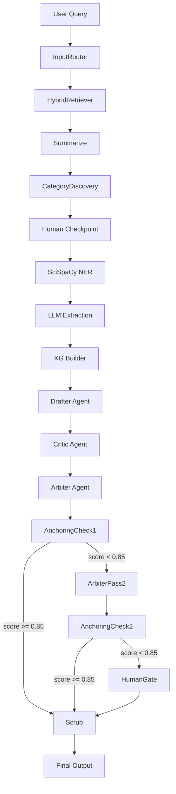

# System Overview

High-level architecture of the Federated RAG biomedical research system.

## Pipeline

## Execution Modes

| Mode | Latency | Architecture | Use Case |
|------|---------|-------------|----------|
| Quick | ~10s | single-agent | Factual lookup |
| Deep | ~60s | full debate+anchoring | Rigorous synthesis |
| Survey | ~8.7min | thematic clustering + multi-theme debate | Broad literature review |

## Sectioned Mode (Phase 7b)

~50s for 4 IMRaD sections. Multi-turn writing with per-section review and claim ledger dedup.

## Core Design Principles

- **Determinism over probability** — reproducible pipelines, cached embeddings, seeded operations
- **Evidence grounding** — every claim traced to source chunks with citation metadata
- **Schema-less extraction** — LLM structures entities without rigid ontology constraints
- **Heterogeneous multi-agent debate** — different model families resist peer-pressure convergence
- **Air-gap security** — Docker network isolation between public and secure corpora

## Detailed Architecture Notes

- [[agent-state]] — Full AgentState TypedDict
- [[deep-mode-graph]] — 17-node deep reasoning graph
- [[survey-mode-graph]] — 8-node survey pipeline
- [[sectioned-survey-graph]] — 8-node IMRaD pipeline
- [[hybrid-retriever]] — ChromaDB + BM25 fusion
- [[llm-provider]] — Unified LLM interface
- [[knowledge-graph]] — KG storage and querying
