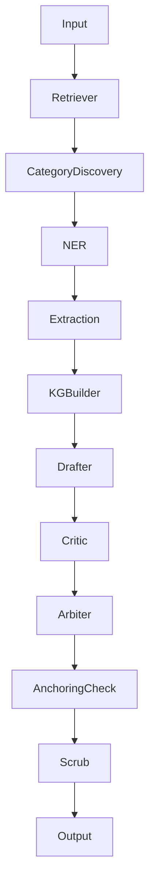

# Federated RAG Dashboard

Home dashboard for the Federated RAG biomedical research project.

## Pipeline Overview

## Phase Status

| Phase | Status | Key Deliverable |
|-------|--------|-----------------|
| 1 | Complete | Query routing + agent state |
| 2 | Complete | Hybrid retrieval + BM25 |
| 3 | Complete | Deep mode graph + debate chain |
| 4 | Complete | Survey mode + thematic clustering |
| 5 | Complete | LLM provider + security modules |
| 6 | Complete | Benchmarking + test suite |
| 7 | Complete | Sectioned survey + vision |
| 8 | Not Started | Neo4j migration + scale target |
| 9 | POC Built | Multi-paper contextual summarization |

## Quick Links

- **Architecture**: [[system-overview]]
- **Phase Status**: [[phase-overview]] | [[phase-dashboard]] (Dataview)
- **Decisions**: [[decisions-overview]] | [[decisions-dashboard]] (Dataview)
- **Gaps**: [[gaps-overview]] (Dataview)
- **Vision Pipeline**: [[phase-7-vision]] | [[figure-extraction]]
- **Multi-Turn Synthesis**: [[phase-7b-synthesis]] | [[sectioned-survey-graph]]
- **Phase 8 Plan**: [[phase-8-initiation]]
- **Testing**: [[test-suite-overview]]
- **Benchmarks**: [[benchmarks-overview]]
- **Model Comparison**: [[model-comparison]]
- **Dev Reference**: [[quick-start]] | [[environment-variables]] | [[file-map]] | [[handoff]]

## Current State

201 tests, 0 failures. Runs on gemma4:e4b + qwen3.6:35b via Ollama. 6-paper corpus (scale caveat). Vision pipeline active. Sectioned survey mode available.

## Key Numbers

| Metric | Value |
|--------|-------|
| Tests | 201 |
| Papers | 6 |
| Figures extracted | 47 |
| Vision model | gemma4:e4b |
| LLM provider | Ollama |
| Cache version | v3 |
